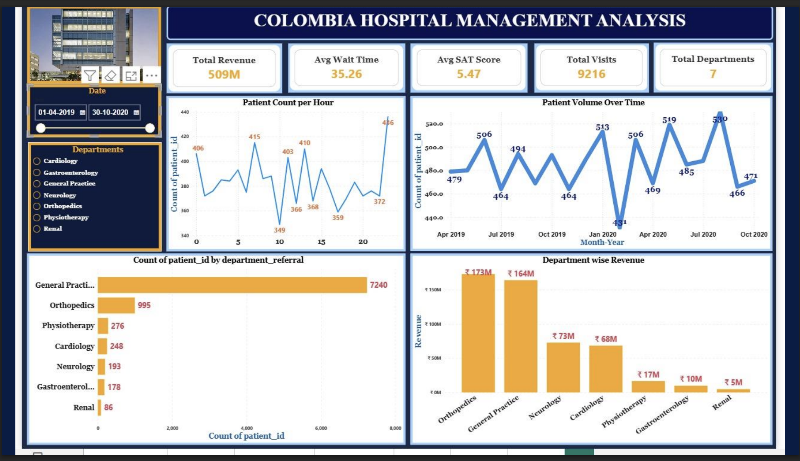

# Columbia Asia Hospital — Healthcare Analytics & Power BI Dashboard

## 📋 Overview
Healthcare analytics project analyzing hospital revenue, patient satisfaction, and operational efficiency using SQL and Power BI. Includes an interactive dashboard, staffing recommendations, and revenue insights for Columbia Asia Hospital.

## 🎯 Problem Statement
As a consultant data analyst, the goal was to help the hospital:
- Improve revenue generation
- Design patient discount strategies
- Identify departments best suited for new hires

## 🛠️ Tools Used
- **SQL** — data analysis and trend identification
- **Power BI** — interactive dashboard development
- **Excel** — data cleaning and preparation

## 📊 Dashboard
A 3-page interactive Power BI dashboard covering:
- **Main Dashboard** – Hospital-wide performance monitoring
- **Doctors Dashboard** – Doctor productivity & revenue analysis
- **Patients Dashboard** – Patient demographics & visit insights

## 🖥️ How to View the Dashboard
Since the `.pbix` file requires Power BI Desktop to open, here's how to view it:

1. **Download Power BI Desktop** (free) from [Microsoft's website](https://powerbi.microsoft.com/desktop/)
2. Download the `Columbia Hospital DASHBOARD.pbix` file from this repo
3. Open the file in Power BI Desktop — you can then interact with the slicers, filters, and drill-downs
4. Alternatively, view the static dashboard screenshots included in `Columbia_Hospital_Analysisppt.pdf` for a quick look without installing anything

## 🔑 Key Findings
- Analyzed **9,200+ patient records** across **7 departments** and **22 doctors**
- Total revenue: **₹509M**
- **General Practice** handles ~80% of total visits — a major workload imbalance
- Top 3 doctors (Smith, Miller, Davis) generate **~76%** of doctor-driven revenue
- 36–75 age group accounts for ~50% of total visits

## 💡 Recommendations
- Hire 2 additional doctors in General Practice, 1 in Neurology
- Introduce tiered patient discounts (10–15%) based on wait time, visit frequency, and demographics
- Diversify revenue beyond Orthopedics & General Practice
- Monitor KPIs (revenue, wait time, satisfaction) regularly to catch declining trends early

## 📁 Files in this Repository
- `Columbia Hospital Analysis Report_.docx` — Full written analysis report
- `Columbia Hospital DASHBOARD.pbix` — Power BI dashboard file
- `Columbia_Hospital_Analysisppt.pdf` — Presentation deck with visuals & insights

## 👤 Author
**Sanika Dhawale**
